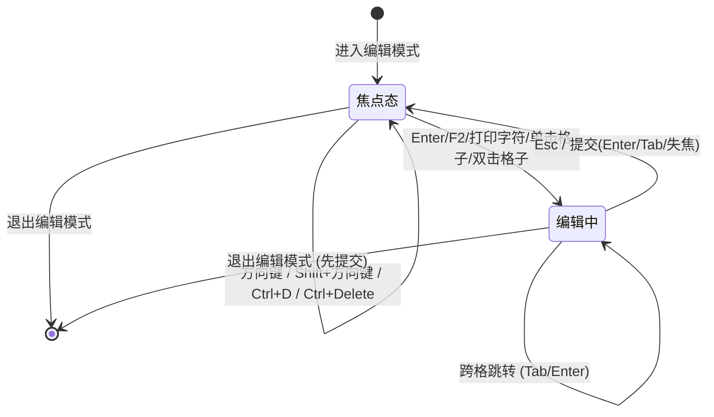

# 实现计划 — Navicat 风格编辑模式升级

## 问题陈述

当前编辑模式功能基本可用，但与 Navicat 相比交互层级多、键盘操作弱、可视反馈薄：

- 只能 Tab/Enter 跨格，无 Navicat 网格焦点 + 方向键导航
- 只支持行多选批量改，无"多单元格框选/同改"
- 行的新增/删除只能靠底部工具条按钮
- 字段选择值是朴素 `<select>` + `<input>`，没有根据列类型做优化
- 编辑模式下禁用双击查看器，遇到长文本不好编辑
- 复选框 Bug：点击后视觉不打勾（`@click.stop.prevent` 阻止了浏览器默认的勾选，`reactive(new Set())` 的 `.has()` 响应在 `:checked` 绑定上不稳定导致视觉不同步）

---

## 已确认的需求

> [!abstract] 来源：需求问答确认

| 编号 | 选择 | 说明 |
|------|------|------|
| 1 | a | **网格焦点 + 方向键导航**：非编辑态下有单元格焦点框，↑↓←→ 移焦点；Enter/F2/字母数字键进入编辑；Esc 退回焦点态；Tab/Enter 维持原有跳转逻辑 |
| 2 | a | **矩形区域框选**：鼠标拖拽 + Shift+方向键扩展；键入覆写整个选区；TSV 粘贴按选区铺开 |
| 3 | a | **常驻底栏"文本选项"**：编辑模式下工具条按钮开关，开启后表格下方出现可拉伸文本编辑面板，联动当前焦点单元格；双击模态查看器仅在非编辑模式保留 |
| Bug | - | 行复选框点击不打勾；其余由我在实现过程中顺带扫描排查 |

---

## 背景（代码现状要点）

- Vue 3.5 + Tauri 2 SFC 单一 `App.vue`（45 万字节），辅助模块位于 `src/tableEditSelection.js`、`src/tableEditNavigation.js`、`src/cellViewer.js`（均有 Node `node:test` 单测）
- 编辑状态集中在 `editMode` / `editingCell` / `editChanges` / `editSelectedRows` 等响应式变量（1269–1289 行）
- 行选择算法 `resolveRowSelection` / `buildBatchCellChanges` 等均为纯函数，已单测通过
- 单元格的渲染 `<td @click @dblclick>` 在 11244–11270 行
- 底部工具栏和"新增行"UI 在 11294–11330 行
- Cell Viewer 模态框在 11444–11505 行

---

## 设计方案

### 模块结构（新增/修改）

```
src/
├── tableGridFocus.js          (新增) 网格焦点 + 方向键解析纯函数
├── tableGridFocus.test.js     (新增) 单测
├── tableCellRange.js          (新增) 矩形框选 / TSV 铺开 / 批量填充纯函数
├── tableCellRange.test.js     (新增) 单测
├── tableEditSelection.js      (保留) 行选中逻辑仍然有效
├── tableEditNavigation.js     (保留) Tab/Enter 逻辑保留
├── cellViewer.js              (保留) 双击预览仍然走它
└── App.vue                    (修改) 注入焦点态、矩形框选、文本底栏、修 Bug
```

### 状态模型

```js
// 单元格焦点（编辑模式；非 null 即显示焦点框）
const gridFocus = reactive({
  rowKind: 'page' | 'insert' | null,
  rowIndex: -1,          // page 中的 idx 或 insert 中的 nIdx
  columnName: '',
})

// 矩形选区（以 gridFocus 为锚点；range 为 null 表示只有焦点）
const gridRange = reactive({
  anchor: { rowKind, rowIndex, columnName } | null,
  head:   { rowKind, rowIndex, columnName } | null,
})
// 选中区 = 两点组成的矩形（同 rowKind 内）

// 文本底栏
const textPanelOpen = ref(false)
const textPanelHeight = ref(220)     // 可拉伸
const textPanelDraft = ref('')       // 与 gridFocus 联动
const textPanelDirty = ref(false)
```

### 键盘交互矩阵（编辑模式）

| 场景 | 按键 | 行为 |
|------|------|------|
| 焦点态 | ↑ ↓ ← → | 移动焦点，跨分页边界不越界 |
| 焦点态 | Shift + ↑↓←→ | 扩展矩形选区 |
| 焦点态 | Enter / F2 | 进入当前单元格编辑 |
| 焦点态 | 可打印字符 | 进入编辑并替换原值为该字符 |
| 焦点态 | Delete / Backspace | 清空当前单元格（或整个选区） |
| 焦点态 | Ctrl+D | 向下填充（Navicat 同） |
| 焦点态 | Ctrl+Enter | 在最后一行下追加新行 |
| 焦点态 | Ctrl+- / Ctrl+Delete | 删除所在行 |
| 焦点态 | Ctrl+C | 复制矩形选区为 TSV |
| 焦点态 | Ctrl+V | 粘贴 TSV 到选区（按选区大小铺开/平铺） |
| 焦点态 | Esc | 清除选区 / 退出编辑模式焦点 |
| 编辑中 | Enter / Shift+Enter / Tab / Shift+Tab | 维持现有行为 |
| 编辑中 | Esc | 放弃并回焦点态 |
| 任意 | F4 | 切换文本面板显示 |

### 底部文本面板 UX

- **开关**：编辑工具栏新增 📝 文本选项 (F4) 按钮，`textPanelOpen` 切换
- **布局**：面板位于表格滚动区下方、工具栏上方，高度由 `textPanelHeight` 拖拽条控制（最小 120px，最大 = 表格容器高度的 60%）
- **内容**：`<textarea>` 大字号、等宽字体、可换行；顶部条显示 `列名 · 行标识`；有"重置"、"写回"、"复制"按钮
- **联动规则**：
  - 焦点单元格变化时，若当前面板未脏 → 自动加载新焦点值
  - 若已脏 → 显示"有未写回修改，是否丢弃？"提示条（非阻塞 Toast）
  - 写回按钮 = 把 `textPanelDraft` 写入 `applyRowCellChange` / `applyInsertCellChange`
  - 面板开着时，单元格的内联 `<input>` 仍然可用（两者都改同一目标）
- **非编辑模式**：按钮隐藏；双击单元格仍然走 `openPageCellViewer` 模态（行为不变）

### 添加行 / 删除行 简化

- 在数据表行的最左悬浮区新增"插入行"按钮（hover 时显示小 `+`），点一下在该行之后插入新空行
- 表尾维持一个"+ 添加行"幽灵行（virtual row），直接点击进入编辑即可创建
- 每一行复选框列右侧 hover 区出现 `⋯` 菜单：删除 / 复制为新行 / 清空
- 顶部工具条新增快捷键提示：`Ctrl+Enter` 新行 · `Ctrl+Delete` 删行 · `Ctrl+D` 向下填充

### Bug 修复（已定位）

> [!warning] 复选框点击不打勾
>
> **根因**：`@click.stop.prevent` 阻止原生 toggle，而 `:checked="editSelectedRows.has(...)"` 对 `reactive(new Set())` 的 `.has()` 依赖追踪在 `.clear()` + `.add()` 连续调用时偶发失配。
>
> **修复**：
> - 将 `editSelectedRows` 改为 `ref(new Set())`，`setEditSelectedRowKeys` 用整体替换（`editSelectedRows.value = new Set(keys)`）保证每次赋值触发响应
> - 模板改为 `editSelectedRows.has(key)`（借助 `.value` 解包）和 `editSelectedRows`（触发依赖）
> - 移除 `.prevent`，保留 `.stop`，让浏览器先画勾，我们同步状态

> [!note] 实现期间顺带扫描
>
> 以下潜在问题若在实际排查中证实存在，都单独提交一次小 fix；若不存在就剔除该项：
>
> 1. 编辑 `<input>` 的 `@blur="confirmCellEdit"` 在 Tab 切换时可能丢失新值（blur 先于键盘导航）
> 2. 分页切换后 `editSelectionAnchorIndex` 不重置导致后续 Shift 选择锚点漂移
> 3. 切换 `cellViewer.manualLanguage` 后焦点会飘回按钮
> 4. ESC 关闭 `cellViewer` 时若 `editDirty` 会吞键（双栈 ESC 没有优先级）
> 5. 粘贴 TSV 到编辑态单元格无法正确拆分多行

### 状态机：焦点 ⇄ 编辑



---

## 任务拆分

> [!tip] 原则
> 每个任务都必须交付可演示、可测试的增量，并和前序任务衔接；**测试优先**。

### Task 1：抽取并单测网格焦点方向键解析器

- **目标**：新建 `src/tableGridFocus.js`，导出 `resolveFocusMove({rowKind, rowIndex, columnName, columns, pageRowCount, insertRowCount, action})`，`action` 取值 `up/down/left/right/home/end/pageUp/pageDown`；返回 `{rowKind, rowIndex, columnName}` 或 `null`
- **实现要点**：跨 `page → insert` 边界规则（下越界进 insert，insert 上越界回 page）；列左右循环；home/end 行首行尾
- **测试**：覆盖 12+ 边界用例，包括空 insert、列名不存在、越界返回 null
- **Demo**：`node --test src/tableGridFocus.test.js` 全绿

### Task 2：抽取并单测矩形选区算法

- **目标**：新建 `src/tableCellRange.js`，导出：
  - `normalizeRange(anchor, head, columns, pageCount, insertCount)` → 规范化后的 `{rowKind, rowStart, rowEnd, colStart, colEnd}`
  - `expandRange(range, direction)` → Shift+方向键扩展
  - `enumerateRangeCells(range, columns)` → 生成可遍历的 `{rowKind, rowIndex, columnName}[]`
  - `fillRangeValue(range, value, columns)` → 批量赋值指令数组
  - `parseClipboardTsv(text)` → `string[][]`
  - `applyTsvToRange(tsv, range, columns)` → 按规则铺开/平铺
- **测试**：12+ 用例覆盖 1×N、N×1、N×M、粘贴维度不匹配的循环填充
- **Demo**：`node --test` 全绿

### Task 3：修复行复选框 Bug（最小修改、独立提交）

- **目标**：只改复选框打勾问题，不引入其它功能
- **实现**：`editSelectedRows` 改为 `ref(new Set())`；`setEditSelectedRowKeys` 用整体替换；模板 `.has()` 调用 `.value.has()`；`@click.stop.prevent` → `@click.stop`；内部 `[...editSelectedRows]` 全部换成 `[...editSelectedRows.value]`
- **验证**：
  - 单元测试：给 `tableEditSelection.test.js` 加一个断言：连续两次 toggle 应恢复初态
  - 手动：在 dev 环境进入编辑模式，逐个点击复选框均能打勾；Shift 区间选择、Ctrl 加选仍然工作
- **Demo**：复选框可以正常打勾，行批量删除/复制/批量改都不回归

### Task 4：网格焦点态可视化 + 方向键/Enter/F2/可打印字符进入编辑

- **目标**：新增 `gridFocus` 状态与焦点框 CSS；绑定全局键盘事件（编辑模式 && 非编辑中）
- **实现**：
  - 单元格 `<td>` 增加 `:class="{'grid-focus': isGridFocused(rowKind, rowIndex, col.column_name)}"`
  - 新 CSS：`.grid-focus { outline: 2px solid var(--accent); outline-offset: -2px; }`
  - 全局 `keydown` 分发（扩展已有的 `onAppKeyDown` 或新增 hook）：`ArrowKeys` → `resolveFocusMove` → 更新 `gridFocus`；`Enter/F2` → 进入编辑；可打印字符 → 进入编辑并预填该字符
  - 单击任一格子也会把 `gridFocus` 指到该格（保留原有单击进入编辑的行为，用户偏好可做成配置）
  - 测试：`resolveFocusMove` 已单测；此任务追加 1 个 `tableGridFocus.test.js` 的集成级回归（纯函数组合）
- **Demo**：编辑模式下，可以用方向键在单元格间移动高亮框，按 Enter 或输入字母进入编辑，ESC 回到焦点态

### Task 5：矩形框选 + Shift+方向键扩展 + 视觉反馈

- **目标**：鼠标拖拽做矩形选区；Shift+方向键扩展；选中区高亮
- **实现**：
  - `<td>` 增加 `@mousedown` / `@mouseenter`（仅编辑模式、非编辑中）：`mousedown` 设 `gridRange.anchor/head` = 当前格，`mouseenter` 在持有鼠标按下时更新 `head`
  - Shift+方向键：`expandRange` 更新 `head`
  - CSS：`.grid-range { background: color-mix(in srgb, var(--accent-soft) 30%, transparent); }`
  - 单元格既有 `edit-cell-active` 不改；新增 `.grid-range-head` 给焦点格
- **测试**：纯算法已单测；加一个 Vue 组件最小集成测试（如项目已有就加，否则跳过不强塞）
- **Demo**：按住鼠标拖拽可以画选区；Shift+方向键扩展选区

### Task 6：选区批量覆写 / Delete 清空 / Ctrl+D 下填充 / TSV 粘贴铺开

- **目标**：基于 Task 5 的选区做批量操作
- **实现**：
  - 焦点态键入可打印字符 → 若有选区 → 弹一个小提示"已填充 N 格"并整区写入；无选区 → 只填当前焦点
  - `Delete/Backspace` → `fillRangeValue(range, '')` 批量清空
  - `Ctrl+D` → 把当前焦点/选区顶行的值向下复制到选区剩余行
  - `Ctrl+C` → 基于 `buildSelectedRowsTsv` 的同款算法但针对矩形选区
  - `Ctrl+V` → 读剪贴板 → `parseClipboardTsv` → `applyTsvToRange`
- **测试**：新增 `tableCellRange.test.js` 的 Ctrl+D 场景与粘贴大小不匹配场景
- **Demo**：选中 5×3 区域键入 `hello` → 全部变 `hello`；复制一段 TSV 粘贴到选区正常铺开

### Task 7：添加行 / 删除行 快捷键与行级操作按钮

- **目标**：简化新增/删除流程
- **实现**：
  - `Ctrl+Enter` 在表尾或当前行下追加新行并把焦点移入新行第一列
  - `Ctrl+Delete` / `Ctrl+-` 删除当前焦点所在行（或整个选区覆盖的行）
  - 行 hover 时在复选框列显示 `+` 与 `⋯` 两个小按钮（`+`：下方插入行；`⋯`：打开包含"复制行到新增"、"删除此行"、"清空此行"的小菜单）
  - 表尾保留"+ 添加行"幽灵行，单击直接编辑
- **测试**：保持现有 `editChanges.inserts` / `editChanges.deletes` 行为的单元测试覆盖率；新增 2 个集成级断言（通过纯函数辅助）
- **Demo**：hover 一行能看到 `+` `⋯`；快捷键可加/删行；表尾幽灵行点击即可新建

### Task 8：底部文本面板（"文本选项"）

- **目标**：实现可开关、可拉伸、联动焦点格的底部编辑器
- **实现**：
  - 工具栏按钮 📝 文本选项 (F4) → 切换 `textPanelOpen`
  - 面板 DOM 位于 `.data-box` 滚动容器下方；顶部有标题栏"列名 · 第 N 行"、复制/重置/写回按钮；中间 `<textarea>`；底部拉伸手柄（`pointerdown` 改 `textPanelHeight`）
  - `watch gridFocus` → 若面板未脏，加载新值到 `textPanelDraft`；若已脏，显示提示条
  - 写回按钮 → 调 `applyRowCellChange` / `applyInsertCellChange`，然后重置 dirty
  - 非编辑模式按钮不显示；双击模态查看器流程完全不改
- **测试**：面板开关状态、联动规则、拉伸边界由一个小纯函数 `resolveTextPanelLoad({focus, panelDirty, lastFocus, draft, originalText})` 承担，单测 6+ 用例
- **Demo**：编辑模式下按 F4 弹出底栏；点击不同单元格内容自动加载；改了未写回切换会提示；写回后数据表立刻反映

### Task 9：扫描并修 5 个候选小 Bug（有则改，无则标注）

- **目标**：对设计里列出的 5 项潜在 Bug 实测：blur 吞值 / 分页后锚点漂移 / 语言切换焦点 / ESC 优先级 / 多行 TSV 粘贴
- **实现**：
  - 每个 Bug 一个小 commit；不存在的明确记在 `docs/plans/2026-05-10-edit-mode-bugs.md` 关账
  - 能通过纯函数覆盖的（如 Esc 优先级的决策函数 `resolveEscTarget`）都抽小函数 + 单测
- **Demo**：给出一份 Bug 扫描报告，每条都有"已修"或"不复现"结论与证据

### Task 10：集成 + 验收 + 文档

- **目标**：把 Task 1–9 产物整合，跑完整构建和测试；更新用户文档
- **实现**：
  - 运行 `npm run build` 确保无 Vue 编译错误
  - 运行 `node --test src/*.test.js` 全绿
  - 更新 `使用说明.md`，增加"Navicat 式编辑体验"章节，附快捷键一览
  - 在 `CLAUDE.md` / `docs/plans/2026-05-10-edit-mode-navicat.md` 写入设计 + 回归要点
- **Demo**：拿着文档按步骤复现所有新功能；展示一次"进入编辑模式 → 方向键导航 → 框选 → 批量改 → 打开文本面板改大字段 → Ctrl+Enter 新增行 → 保存"完整流程
